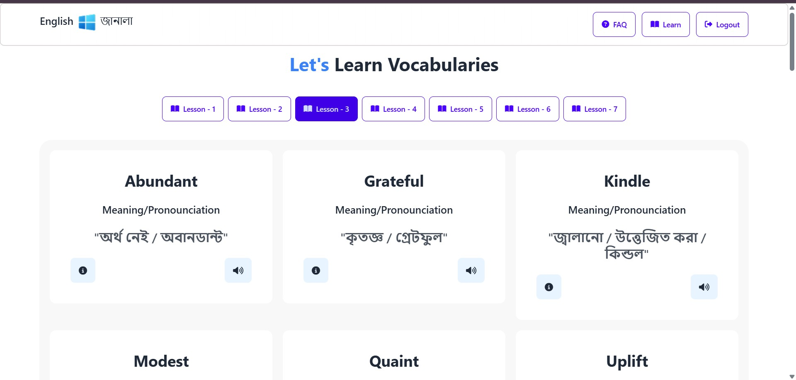

# English Janala - Vocabulary Learning Platform

## Overview
English Janala is an interactive web-based vocabulary learning platform designed to enhance users' language skills. It features a seamless user experience with dynamic content loading, custom navigation, a secure login system, and an engaging UI based on a Figma design.

## Live Demo
[Explore English Janala](https://enlishjanala.netlify.app/)

## Technologies Used
- **HTML**
- **Tailwind CSS**
- **JavaScript**

## GitHub Repository
[Visit the Repository](https://github.com/nitaisutradhar/English-Janala.git)

---

## Features

### 🌐 Navigation Bar
- Fixed at the top with a bottom border.
- Contains a **logo** and **brand name**.
- Three interactive buttons:
  - **FAQ** – Navigates to the FAQ section.
  - **Learn** – Navigates to the Vocabulary section.
  - **Logout** – Logs the user out and resets the UI.

### 🎯 Banner Section
- Displays a **title, description, and login form** on the left.
- Includes an **illustrative image** on the right.
- Fully aligned with the Figma design.

### ❓ FAQ Section
Provides answers to key JavaScript-related questions:
1. Difference between `var`, `let`, and `const`.
2. Difference between `map()`, `forEach()`, and `filter()`.
3. Arrow functions vs. regular functions.
4. How JavaScript Promises work.
5. Understanding JavaScript closures.

### 📌 Vocabulary Section
- Displays a **center-aligned heading**.
- Dynamically generates **lesson buttons** from **API-01** upon page load.
- Clicking a lesson button:
  - Fetches words via **API-02**.
  - Displays words in **card format** with:
    - Word
    - Meaning & pronunciation
    - Two interactive buttons
- Shows **'No Word Found'** message if no words exist.
- Highlights the **active lesson** button.

### 📖 Vocabulary Details
- Clicking the **details icon** opens a modal displaying:
  - Word with pronunciation
  - Example sentence
  - Synonyms
  - "Complete Learning" button to close the modal
- Data is loaded from **API-03**.

### 🔄 Custom Navigation & Smooth Scrolling
- Initially, only the **Banner and Footer** are visible.
- **Login functionality:**
  - Displays an **alert** if the name is missing.
  - Shows an **alert** if the password is incorrect (Only `123456` is accepted).
  - On successful login:
    - Displays a **success alert**.
    - Hides the **Banner**.
    - Shows **Navbar, Vocabulary Section, and FAQ Section**.
- **Logout functionality:**
  - Hides **Navbar, Vocabulary Section, and FAQ Section**.
  - Displays only the **Banner and Footer**.
- **Smooth scrolling** implemented for FAQ & Learn buttons.

### 🚀 Additional Features
- **Error Handling:** Prevents displaying falsy values (`undefined` or `null`).
- **Loading Spinner:** Displays a spinner while fetching vocabulary data.
- **SweetAlert2 Integration:** Enhances alerts with visually appealing popups.
- **Voice Pronunciation:** Implements `SpeechSynthesisUtterance` API to pronounce words.

```js
function pronounceWord(word) {
    const utterance = new SpeechSynthesisUtterance(word);
    utterance.lang = 'en-EN'; // English
    window.speechSynthesis.speak(utterance);
}
```

---

## 📌 API Requirements
1. **API-01**: Retrieves lesson buttons.
2. **API-02**: Fetches words for the selected lesson.
3. **API-03**: Provides detailed information about a selected word.

## 🛠️ Setup Instructions
1. **Clone the repository:**
   ```sh
   git clone https://github.com/nitaisutradhar/English-Janala.git
   ```
2. **Navigate to the project directory:**
   ```sh
   cd English-Janala
   ```
3. **Open `index.html` in a browser** or run a local server.

---

## 🖼️ Screenshots
| Login Page | Vocabulary Section | FAQ Section |
|------------|-------------------|-------------|
|  |  |  |

---

## 🤝 Contributing
- **Fork** the repository.
- Create a **new branch**.
- Make meaningful **commits**.
- Submit a **pull request** for review.

## 📜 License
This project is open-source and available under the [MIT License](LICENSE).

